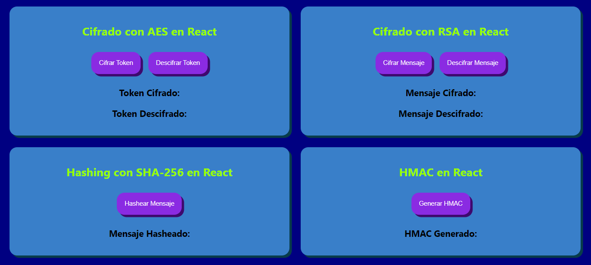

# ENCRYPT

Este proyecto se realizó con el fin de implementar 4 técnicas de cifrado desde el Frontend:

1. **AES** es útil cuando necesitas cifrar grandes cantidades de datos de manera rápida.
2. **RSA** se usa principalmente para transmitir datos de forma segura entre el frontend y el backend.
3. **SHA-256** se usa para crear firmas digitales o verificar la integridad de los datos.
4. **HMAC** asegura que los mensajes o las solicitudes API no hayan sido modificados.

##Demo: 
https://encryption-frontend.vercel.app/

